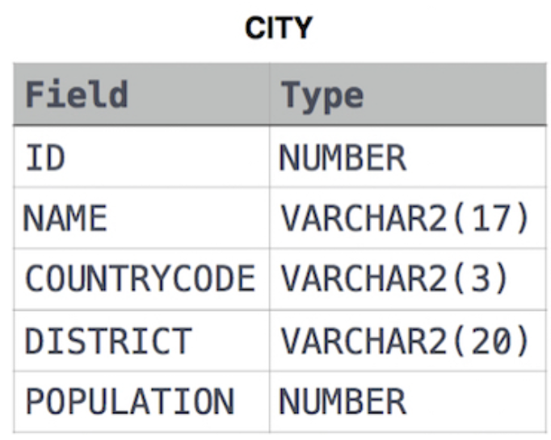
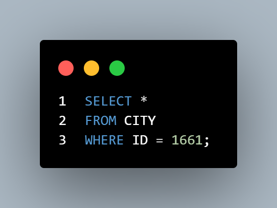
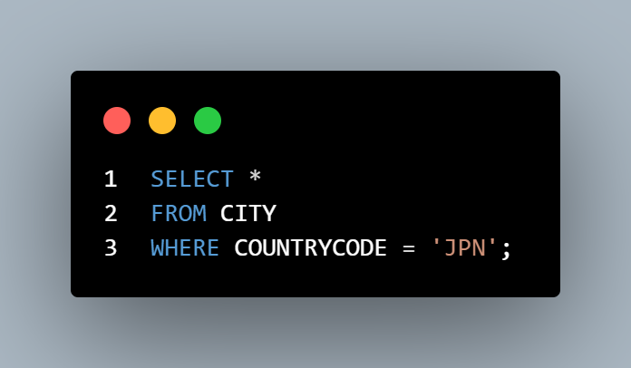
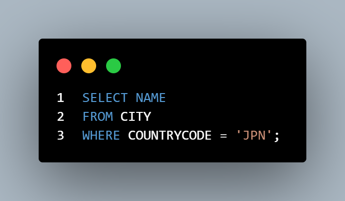
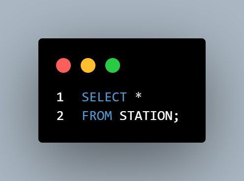
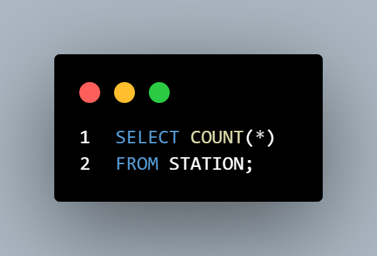
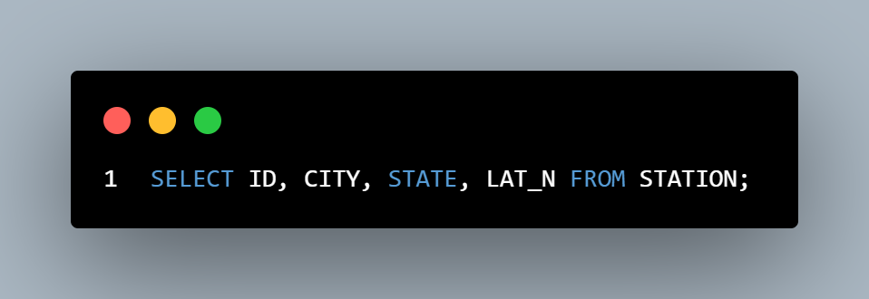
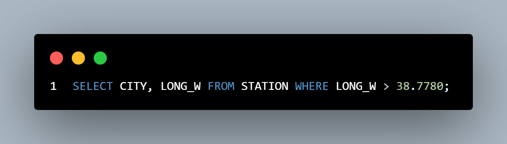

# EjerciciosSQL-HackerRank
---
## SQL - BASIC
---

### 1. Revising the Select Query I
Consulta todos los campos de la tabla CITY.
 

**Solución:**
 

**Explicación:**
* Se utiliza `SELECT *` para obtener todas las columnas de la tabla CITY.

---

### 2. Revising the Select Query II
Consulta el nombre de todas las ciudades de la tabla CITY.
 

**Solución:**
 

**Explicación:**
* Se selecciona únicamente la columna NAME de la tabla CITY.

---

### 3. Select All
Consulta todos los campos de la tabla CITY.
 

**Solución:**
 

**Explicación:**
* Se utiliza `SELECT *` para obtener todas las columnas.

---

### 4. Select By ID
Consulta todos los campos de la tabla CITY donde el ID sea 1661.
 

**Solución:**
 

**Explicación:**
* Se utiliza la cláusula `WHERE` para filtrar por el ID especificado.

---

### 5. Japanese Cities' Attributes
Consulta todos los campos de la tabla CITY donde el COUNTRYCODE sea 'JPN'.
 

**Solución:**
 

**Explicación:**
* Se filtran las ciudades cuyo código de país es 'JPN'.

---

### 6. Japanese Cities' Names
Consulta el nombre de todas las ciudades de la tabla CITY donde el COUNTRYCODE sea 'JPN'.
 

**Solución:**
 

**Explicación:**
* Se selecciona la columna NAME para las ciudades japonesas.

---

### 7. Weather Observation Station 1
Consulta todos los campos de la tabla STATION.
 

**Solución:**
 

**Explicación:**
* Se utiliza `SELECT *` para obtener todas las columnas de la tabla STATION.

---

### 8. Weather Observation Station 3
Consulta la cantidad total de registros en la tabla STATION.
 

**Solución:**
 
**Explicación:**
* Se utiliza la función de agregación `COUNT(*)` para contar todos los registros.

---

### 9. Weather Observation Station 4
Consulta el ID, ciudad, estado y latitud de todas las estaciones.
 

**Solución:**
 

**Explicación:**
* Se seleccionan columnas específicas de la tabla STATION.

---

### 10. Weather Observation Station 6
Consulta la ciudad y su longitud para todas las estaciones donde la longitud sea mayor que 38.7780.
 

**Solución:**
 

**Explicación:**
* Se filtran las estaciones con LONG_W mayor a 38.7780.

