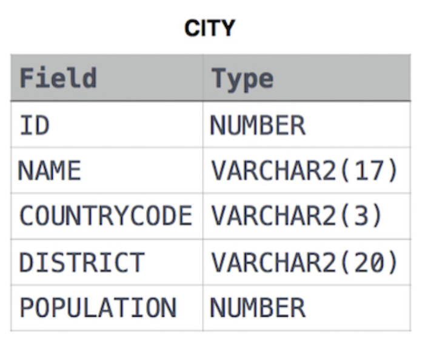
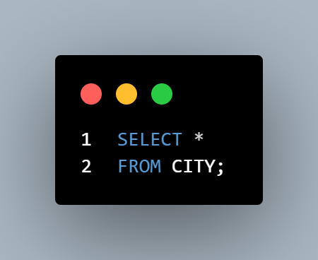
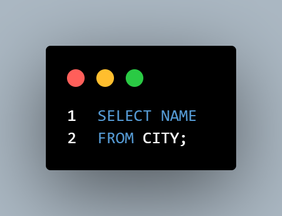

# EjerciciosSQL-HackerRank
---
## SQL - BASIC
---

### 1. Revising the Select Query I
Consulta todos los campos de la tabla CITY.
 

**Solución:**
 

**Explicación:**
* Se utiliza `SELECT *` para obtener todas las columnas de la tabla CITY.

---

### 2. Revising the Select Query II
Consulta el nombre de todas las ciudades de la tabla CITY.
 

**Solución:**
 

**Explicación:**
* Se selecciona únicamente la columna NAME de la tabla CITY.

---
